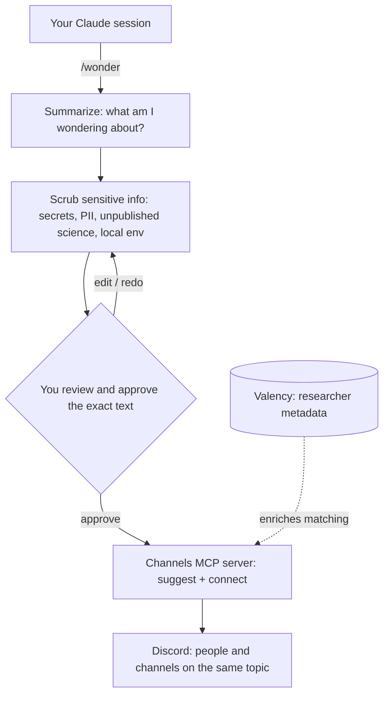

# wonder

A project from the **AI for Science Power Users** gathering.

`wonder` helps the people at the gathering find each other. You've been working
in a Claude session on some piece of science. You run `/wonder`. It reads what
you've been doing, writes a short, shareable summary of what you're *wondering
about* — scrubbed of anything sensitive — and, once **you** approve it, routes
you to the people and Discord channels working on the same things.

> **Status: early design sketch, pre-build.** Nothing here is implemented yet.
> This document is a starting point for the group to react to and refine — the
> open questions and assumptions below are the parts that most need your input.

## The idea

The gathering is full of people quietly working on overlapping problems who will
never discover each other in a hallway. But each of them has just spent hours
explaining their problem to Claude. That session *is* the perfect description of
what they're working on — it's just also full of things they'd never want to
broadcast (unpublished results, file paths, API keys, collaborators' names).

`wonder` turns that session into a safe, one-paragraph "here's what I'm wondering
about" that can be matched against everyone else's — and uses it to connect
people on Discord.

## How it works (proposed)



The non-negotiable property: **nothing leaves your machine until you've seen the
exact text and approved it.** `/wonder` drafts and sanitizes locally; the human
is the final gate; the MCP server only ever receives the approved summary.

## Components

### 1. The `/wonder` command
Orchestrates the flow. Reads the current session, calls the summarizer, runs the
scrubbing skills, shows you the result, and — only on your approval — hands the
sanitized profile to the MCP server. Owns the **profile schema** (below), which
is the contract everything else depends on.

### 2. Summarization → a "wonder profile"
Distills the session into a small, shareable, *structured* profile rather than a
blob of text, because structure makes both scrubbing and matching tractable:

- **Wondering about** — one line, the core question/problem
- **Field / domain** — e.g. structural biology, climate modeling
- **Methods & tools** — techniques, models, instruments in play
- **Looking for** — collaborators? data? a technique? feedback?
- **Can offer** — what you bring
- **Tags** — keywords used for channel matching

### 3. Scrubbing skills (a set, not one)
Each skill targets one category of sensitive content so they're composable and
independently testable. `/wonder` runs them over the draft in sequence:

- **secrets** — API keys, tokens, passwords, connection strings (deterministic)
- **local-env** — file paths, hostnames, usernames, internal URLs (deterministic)
- **pii** — names, emails, affiliations of people who haven't consented
- **unpublished-science** — pre-publication results, raw data values, sequences,
  compound structures, grant numbers, anything under embargo / IP / NDA. This is
  the hard, science-specific case and leans on model judgment, not regex.

Scrubbing *proposes*; the user *disposes*. The review gate is part of the system,
not an afterthought.

### 4. Channels MCP server
Already-imagined as the routing brain. Holds the catalog of Discord channels and
exposes a small, deliberately split interface:

- `suggest_channels(profile)` → ranked channels/people (read-only, safe to call)
- `connect(profile, channel)` → the actual Discord side effect (intro / invite)

Keeping the read-only suggestion separate from the side-effecting connect keeps
the user in control of the one step that's hard to undo.

### 5. Valency enrichment *(ultimately)*
Given a person's identity (name / ORCID, provided explicitly and opt-in), Valency
supplies research profile, adjacent topics, and nearby researchers — so matching
becomes "people whose work is adjacent to yours," not just keyword overlap. Treat
this as an enrichment layer *after* a keyword-based MVP works.

## Privacy & trust model (the core constraint)

- **Local-first** — summarizing and scrubbing happen in your session, on your machine.
- **Human-in-the-loop** — you see the exact text and explicitly approve; `/wonder` never auto-sends.
- **Defense in depth** — layered scrubbing skills *plus* human review; neither is trusted alone.
- **Least disclosure** — share the minimum needed to match (intent and topic), never the raw transcript.
- **Minimal surface to the server** — the MCP server receives only the approved profile.

## Open questions (for the group)

1. **Session access** — summarize from Claude's current in-context view (simplest) or read the raw transcript `.jsonl` for completeness?
2. **Who does the Discord write** — does `connect` post on the server side, or does it return an invite the user clicks?
3. **Identity & attribution** — anonymous match, or a named intro? How does a person supply their name/ORCID?
4. **Hosting** — where does the MCP server + channel catalog run during the gathering?
5. **Profile shape** — how much structured vs. freeform?
6. **Scrubbing depth** — deterministic rules cover secrets/paths; how aggressive should the model be on "unpublished science"?

## Suggested build slices (≈4 people, parallelizable)

Two interfaces let everything proceed in parallel — pin these down together
*first*: **(a) the wonder-profile schema** and **(b) the MCP tool contract**.

| Slice | Owns | Depends on |
|-------|------|------------|
| A. `/wonder` command + summarizer | orchestration, profile schema | — |
| B. Scrubbing skills + review gate | the scrub skill set | profile schema |
| C. Channels MCP server | catalog, `suggest`/`connect` | MCP contract |
| D. Valency matching + Discord | enrichment, the actual connect | MCP contract, Valency |

## Proposed repo layout

```
wonder/
  commands/wonder.md        # the /wonder command (Claude Code plugin)
  skills/
    summarize-session/      # session -> wonder profile
    scrub-secrets/
    scrub-local-env/
    scrub-pii/
    scrub-unpublished/
  server/                   # channels MCP server: catalog + routing
  .mcp.json                 # wires the server into Claude
  PROFILE.md                # the shared wonder-profile schema (the contract)
```
