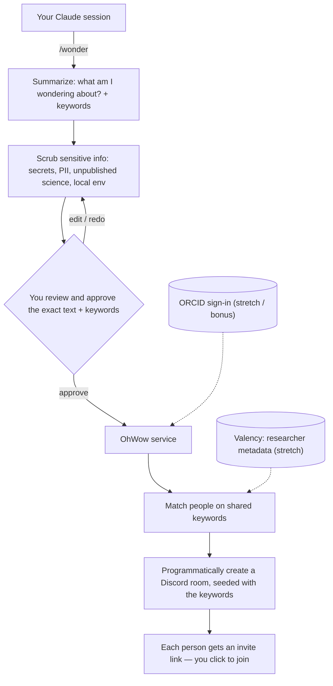

# wonder

A project from the **AI for Science Power Users** gathering.

`wonder` helps the people at the gathering find each other. You've been working
in a Claude session on some piece of science. You run `/wonder`. It reads what
you've been doing, writes a short, shareable summary of what you're *wondering
about* — plus a few keywords — scrubbed of anything sensitive. Once **you**
approve it, it hands those keywords to **OhWow**, a service that matches you
against everyone else and drops you into a Discord room with the people working
on the same thing.

> **Status: working MVP, deployed.** `/wonder` runs end-to-end against a hosted
> OhWow MCP server (on Railway), creating/joining real Discord rooms. Install it
> from `ohwow.science/install`. See the live walkthrough just below.

## The idea

The gathering is full of people quietly working on overlapping problems who will
never discover each other in a hallway. But each of them has just spent hours
explaining their problem to Claude. That session *is* the perfect description of
what they're working on — it's just also full of things they'd never want to
broadcast (unpublished results, file paths, API keys, collaborators' names).

`wonder` turns that session into a safe set of keywords (and a one-paragraph
"here's what I'm wondering about"). **OhWow** takes those keywords, finds the
other people wondering about the same things, and connects them in a Discord room
— seeded with those shared keywords so there's an instant starting point for
conversation.

The feeling we're after: you're heads-down in a session, a little lonely talking
only to agents, you type `/wonder` — and a few minutes later you're in a room
with humans who care about the same thing you do.

## Naming

- **`/wonder`** — the command a user runs inside Claude Code.
- **OhWow** — the MCP service everyone's `/wonder` talks to. It matches on
  keywords and owns the Discord room creation + invites. (Working name; candidate
  domain TBD — `ohwow.science` was floated.)

## Live walkthrough

A real `/wonder` run against the hosted OhWow MCP, using a Claude session as the
source. The five steps the command performs:

1. **Summarize the session → a wonder profile.** Distill the live session into a
   one-line "wondering about", field, methods, and a tight keyword set. Example
   from a session spent building OhWow itself:
   - *Wondering about:* wiring Claude Code sessions to a Discord matchmaking service over MCP
   - *Keywords:* `mcp server`, `discord api`, `claude code plugins`, `researcher matchmaking`, `ai for science`

2. **Scrub.** Run the scrub skills over the draft. In this run, none of the
   secrets / file paths / tokens that appeared in the session made it into the
   keywords.

3. **Review gate.** Show the user the exact keywords. Nothing is sent until they
   approve.

4. **Connect via the OhWow MCP.** `suggest_rooms` previews matches (read-only),
   then `connect` does the one side-effecting call:

   ```
   join_demo            -> demo mode active? false
   suggest_rooms        -> [{room: serendipitous-matching-roundtable, overlap: 1},
                            {room: discord-invite-links-lab, overlap: 1}]
   connect              ->
     room:            #serendipitous-matching-roundtable
     reused existing: true (overlap 1)        # convergence: routed into a live room,
                                              # not a brand-new empty one
     serverInviteUrl: https://discord.gg/…    # join the server (if you're not in it)
     roomUrl:         https://discord.com/channels/…/…   # then open the room
   ```

5. **Hand off.** The user gets two links — **`serverInviteUrl`** to join the
   server and **`roomUrl`** to open the room. Already-members just use `roomUrl`.

The notable bit: `connect` **reused an existing room** instead of creating a new
one, because the keywords overlapped — so overlapping topics *converge* rather
than multiply. Rooms are only ever created/joined by an explicit, user-triggered
`/wonder`; nothing runs in the background except a delete-only idle-room reaper.

## How it works



The non-negotiable property: **nothing leaves your machine until you've seen the
exact text and approved it.** `/wonder` drafts and sanitizes locally; the human
is the final gate; OhWow only ever receives the approved keywords/summary.

## The Discord side (core mechanic)

This is the heart of the demo. Via the Discord API, OhWow:

1. **Programmatically creates a room** (channel) when a set of people match.
2. **Seeds it with the shared keywords** — a starter message / topic so people
   land on common ground instead of an empty room.
3. **Invites the matched people** by handing each one an **invite link**.
4. Each person **actively clicks** to join — nobody is silently teleported in.
   Stay as long as you want, leave anytime.

**Not pairwise — one-to-N.** You aren't matched to a single person; you're routed
to a *room* of everyone wondering about the same cluster. Rooms scale with the
crowd: six people total might mean one shared room; a thousand means many more
specialized ones.

## Components

### 1. The `/wonder` command
Orchestrates the flow. Reads the current session, calls the summarizer, runs the
scrubbing skills, shows you the result, and — only on your approval — hands the
sanitized keywords + profile to OhWow. Owns the **profile schema** (below), which
is the contract everything else depends on. It's user-triggered: you're in the
middle of something, you decide you want company, you type `/wonder`.

### 2. Summarization → a "wonder profile"
Distills the session into a small, shareable, *structured* profile rather than a
blob of text, because structure makes both scrubbing and matching tractable:

- **Wondering about** — one line, the core question/problem
- **Field / domain** — e.g. structural biology, climate modeling
- **Methods & tools** — techniques, models, instruments in play
- **Looking for** — collaborators? data? a technique? feedback?
- **Can offer** — what you bring
- **Keywords** — the terms OhWow matches on and seeds the room with

### 3. Scrubbing skills (a set, not one)
Each skill targets one category of sensitive content so they're composable and
independently testable. `/wonder` runs them over the draft in sequence. You can
also pre-declare things to never leak ("do not mention this word / this IP"):

- **secrets** — API keys, tokens, passwords, connection strings (deterministic)
- **local-env** — file paths, hostnames, usernames, internal URLs (deterministic)
- **pii** — names, emails, affiliations of people who haven't consented
- **unpublished-science** — pre-publication results, raw data values, sequences,
  compound structures, grant numbers, anything under embargo / IP / NDA. This is
  the hard, science-specific case and leans on model judgment, not regex.

Scrubbing *proposes*; the user *disposes*. The review gate is part of the system,
not an afterthought.

### 4. OhWow MCP service
The routing brain. Matches incoming keyword sets, and drives the Discord side —
creating rooms, seeding them, and issuing invites. A small, deliberately split
interface:

- `suggest_rooms(profile)` → ranked rooms/people (read-only, safe to call)
- `connect(profile, room)` → the actual Discord side effect (creates + seeds the
  room if needed, returns an invite link the user clicks)

Keeping read-only suggestion separate from the side-effecting connect keeps the
user in control of the one step that's hard to undo.

### 5. Stretch / bonus layers
- **ORCID sign-in.** Authenticating to OhWow with an ORCID gives a real research
  identity, cuts down on abuse and the "dating app" angle, and avoids per-user
  tokens. **Bonus — only if we get to it.** v1 works on keywords alone.
- **Valency enrichment.** Given an ORCID, Valency supplies research profile,
  adjacent topics, and nearby researchers — so matching becomes "people whose
  work is adjacent to yours," not just keyword overlap. Stood up behind a single
  shared token so users don't each need their own. An enrichment layer *after* the
  keyword MVP works.

## Privacy, trust & abuse

- **Local-first** — summarizing and scrubbing happen in your session, on your machine.
- **Human-in-the-loop** — you see the exact text and explicitly approve; `/wonder` never auto-sends.
- **Defense in depth** — layered scrubbing skills *plus* human review; neither is trusted alone.
- **Least disclosure** — share the minimum needed to match (keywords + intent), never the raw transcript.
- **Minimal surface to the service** — OhWow receives only the approved keywords/profile.
- **Opt-in, high trust to start** — initially only people in the room, all opted in.
- **Abuse is stage two.** People will inevitably reach for something like this for
  connection or advice. We're not policing topics, but the moderation/liability
  layer is deliberately deferred; opt-in + invite-to-join is the v1 guardrail.

## Status

Built and deployed — see the live walkthrough above, and `ROADMAP.md` for what's next.
The hackathon "plumbing" is real and end-to-end: `/wonder` summarizes → scrubs →
(on your approval) hands keywords to the hosted OhWow MCP server, which **matches on
keyword overlap** (with a size-aware room policy) and creates or joins a seeded Discord
room. ORCID is in as an **opt-in** identity (self-declared in v1; verified sign-in is on
the roadmap). Embeddings/Valency matching is still future work. Settled choices live in
`DECISIONS.md`.

**Demo mode** (`join_demo` / `OHWOW_DEMO=1`) remains for live group runs — it
short-circuits summarize/scrub and converges everyone into one shared, seeded room.

## Open questions

Most of the early questions are settled (`DECISIONS.md`) or tracked as roadmap items
(`ROADMAP.md`). Genuinely still open:

- **Scrubbing aggressiveness** — how cautious the model pass should be by default on
  "unpublished science" (over-redacting kills matching signal).
- **Session access** — summarize from Claude's in-context view (today) or read the raw
  transcript `.jsonl` for completeness (it catches compacted-out context)?
- **Room auto-split** — when a room gets large, who/what decides to split it into
  specialized rooms? (The join-vs-create policy is built; dynamic splitting isn't.)

## The four parts

The system is four components around two contracts — the wonder-profile / keyword
schema and the OhWow tool contract. All four are built:

| Slice | Owns | Depends on |
|-------|------|------------|
| A. `/wonder` command + summarizer | orchestration, profile schema | — |
| B. Scrubbing skills + review gate | the scrub skill set | profile schema |
| C. OhWow MCP service + matching | keyword matching, `suggest`/`connect` | OhWow contract |
| D. Discord API: rooms + invites | create/seed rooms, invite links (keyword-seeded) | OhWow contract |

## Repo layout

```
wonder/
  commands/wonder.md        # the /wonder command (Claude Code plugin)
  skills/
    summarize-session/      # session -> wonder profile + keywords
    scrub-secrets/
    scrub-local-env/
    scrub-pii/
    scrub-unpublished/
  server/                   # OhWow MCP service: matching + Discord room routing
  discord/                  # Discord API: create/seed rooms, invite links
  .mcp.json                 # wires OhWow into Claude
  PROFILE.md                # the shared wonder-profile schema (the contract)
```

## Development

**Install** (only the JS side has dependencies):

```bash
make install          # or: cd discord && npm install
```

**Run the tests** — one command for both languages:

```bash
make test             # Python (pytest) + JS (node --test)
```

- **Python** — `tests/` (pytest): the deterministic scrub scripts (`localenv`, `pii`,
  `filterlist`) and the `orcid` validator. Scripts are loaded as modules via
  `tests/conftest.py`; the CLI contract is exercised through subprocess. Run on
  Python ≥3.9 (stdlib only).
- **JS** — `discord/src/*.test.js` (`node --test`): the room-matching policy
  (`chooseRoom`) and Discord helpers (`rooms`).

**Run the OhWow server locally:** see `server/README.md` (stdio for Claude Code, or
HTTP). Discord creds live in `discord/.env` (gitignored) — see `discord/README.md`.
Pushing to `main` auto-deploys the server + frontend.
